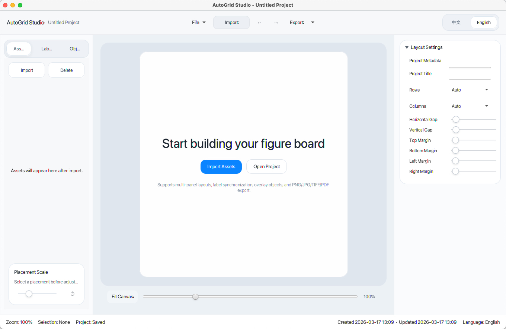

# AutoGrid Studio

AutoGrid Studio is a desktop app for turning collections of images into clean, consistent figure layouts fast.

It is built for workflows where you need to place multiple images into a structured grid, add labels, annotate key areas, and export polished results without fighting a general-purpose design tool.



# Platform Support

- macOS
- Windows

## macOS Notice

If macOS shows that AutoGrid Studio is damaged and cannot be opened, open Terminal and run:

```bash
xattr -dr com.apple.quarantine "/Applications/AutoGrid Studio.app"
```

## What It Does

AutoGrid Studio helps you create:

- multi-panel scientific figures
- comparison layouts
- result boards and summary images
- annotated presentation graphics
- reusable figure projects that can be edited later

Instead of manually aligning elements over and over, you work in a layout-focused editor designed for repeatable image composition.

## Why AutoGrid Studio

Most image layout tools are either too general or too manual for this kind of work.

AutoGrid Studio focuses on the parts that matter most:

- fast multi-image grid composition
- consistent panel labeling
- simple annotation workflows
- editable saved projects
- reliable export for final delivery

## Key Features

- Import image and PDF assets
- Build structured multi-image grid layouts
- Adjust rows, columns, spacing, margins, order, and per-item scale
- Create label groups with synchronized style and content rules
- Add rectangles, ellipses, circles, lines, arrows, and text annotations
- Use both global annotations and panel-specific annotations
- Save projects as `.ags` files and continue editing later
- Export to `PNG`, `JPG`, `TIFF`, and `PDF`
- English and Chinese interface support
- Available on macOS and Windows

## Download And Install

Download the latest installer from the repository's Releases page:

- macOS: download the macOS installer package from `Releases`
- Windows: download the Windows installer package from `Releases`

After downloading, open the installer and follow the standard installation steps for your platform.

## Typical Use Cases

- scientific paper figures
- experimental result layouts
- before/after comparisons
- image collections with labels and callouts
- presentation-ready research graphics

## Project Files

AutoGrid Studio uses the `.ags` project format to store:

- layout structure
- imported asset references
- label settings
- annotation objects
- project metadata

This makes it easy to come back to a figure and revise it later instead of rebuilding it from scratch.

## Export Formats

- PNG
- JPG
- TIFF
- PDF

## Built For

- researchers
- students and lab members
- educators
- creators who regularly assemble structured image layouts
- anyone who wants a dedicated desktop tool for multi-image figure composition

## Summary

AutoGrid Studio is a focused desktop product for structured image layout, synchronized labeling, and annotation-based figure creation.

If your workflow depends on arranging many images into a polished, consistent final result, AutoGrid Studio is designed to make that process faster and easier.
